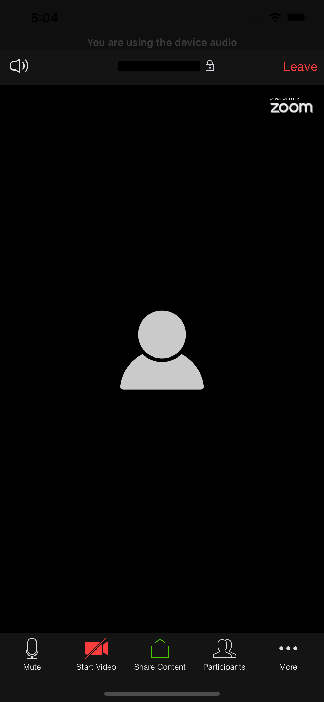

# react-native-zoom-bridge



React-native bridge for ZoomUs video conference calls [android](https://github.com/zoom/zoom-sdk-android) & [iOS](https://github.com/zoom/zoom-sdk-ios) SDK's

## Getting started

`$ npm install react-native-zoom-bridge --save`

## Pre-requisites

### iOS
Go to zoom.us and download the [SDK for iOS](https://marketplace.zoom.us/docs/sdk/native-sdks/android/getting-started/install-sdk#1-download-the-zoom-sdk)

## Important Note
##### SDK-type

There is two SDK's provided by zoom for iOS, development & production sdk's - **you will get a build fail if you run production sdk on a simulator and a compilation error when archiving the app for release if using the development sdk!**

Check out this https://marketplace.zoom.us/docs/sdk/native-sdks/iOS/getting-started/integration#5-deployment and make sure you have the correct SDK for your build. 

You can download the development sdk from here https://github.com/zoom/zoom-sdk-ios/releases/download/v4.6.15084.0206/ios-mobilertc-all-4.6.15084.0206-n.zip on the latest releases page https://github.com/zoom/zoom-sdk-ios/releases. 

Check out the description on Zoom's github page https://github.com/zoom/zoom-sdk-ios.

The issue when releasing to app store with unsupported architecture is because the development SDK works for both simulator and real device. You can work around this issue by following this answer to add script in `Build Phases` that filters out unsupported architectures: https://stackoverflow.com/questions/30547283/submit-to-app-store-issues-unsupported-architecture-x86. You may want to modify the script to be more specific, i.e. replace `'*.framework'` with `'MobileRTC.framework'`

### Android
Go to zoom.us and download the [aar files for android](https://marketplace.zoom.us/docs/sdk/native-sdks/android/getting-started/install-sdk#1-download-the-zoom-sdk) and take out the aar files from `/mobilertc-android-studio/mobilertc` && `/mobilertc-android-studio/commonlib`

Place them in their platform respective locations as follows:

iOS: `node_modules/react-native-zoom-bridge/ios/libs`

Android: `node_modules/react-native-zoom-bridge/android/libs`

For `iOS` when building for development make sure to put in the development sdk otherwise you will get a build error see above [Important Note](#SDK-type).

### Mostly automatic installation

On react-native versions 60+ for *ios* just `cd ios/` and `pod install` - make sure you already have the right SDK in the `libs` folder before running `pod install`

for lower react-native versions run `$ react-native link react-native-zoom-bridge`

#### Extra steps for Android

Since Zoom SDK `*.aar` libraries are not globally distributed
it is also required to manually go to your project's `android/build.gradle` and under `allprojects.repositories` add the following:
```gradle
allprojects {
    repositories {
        flatDir {
            dirs "$rootDir/../node_modules/react-native-zoom-bridge/android/libs"
        }
        ...
    }
    ...
}
```

If you have problem with multiDex go to your project's `android/app/build.gradle` and under `android.defaultSettings` add the following:
```gradle
android {
    defaultConfig {
        multiDexEnabled true
        ...
    }
    ...
}
```

#### Extra steps for iOS

1. In XCode, in your main project go to `Build Settings` tab:
* search for `Enable Bitcode` and make sure it is set to `NO`

2. In XCode, in your main project go to `Info` tab and in the following keys enter the appropriate description:
* `NSCameraUsageDescription`
* `NSMicrophoneUsageDescription`
* `NSPhotoLibraryUsageDescription`
* `NSBluetoothPeripheralUsageDescription`
  
## Important

You might have to fix the imports of the headers in the SDK e.g. from `<MobileRCT/MobileRCT.h>` to `<MobileRCT.h>` from `<MobileRCT/MobileRCTConstants.h>` to `<MobileRCTConstants.h>`, if you get **`'MobileRCT/MobileRCTConstants.h' not found`** error then you have to rename the headers as mentioned throughout the whole SDK.

### Manual installation

#### iOS

1. In XCode, in the project navigator, right click `Libraries` ➜ `Add Files to [your project's name]`
2. Go to `node_modules` ➜ `react-native-zoom-bridge` and add `RNZoomBridge.xcodeproj`
3. In XCode, in the project navigator, select your project. Add `libRNZoomBridge.a` to your project's `Build Phases` ➜ `Link Binary With Libraries`
4. Run your project (`Cmd+R`)<
5. In XCode, in your main project go to `General` tab, expand `Linked Frameworks and Libraries` and add the following libraries:
   * `libsqlite3.tbd`
   * `libc++.tbd`
   * `libz.1.2.5.tbd`
   * `CoreBluetooth`
   * `VideoToolbox`
   * `ReplayKit`
6. In XCode, in your main project go to `General` tab, expand `Linked Frameworks and Libraries` and add `MobileRTC.framework`:
   * choose `Add other...`
   * navigate to `../node_modules/react-native-zoom-bridge/ios/libs`
   * choose `MobileRTC.framework`
7. In XCode, in your main project go to `General` tab, expand `Embedded Binaries` and add `MobileRTC.framework` from the list - should be at `Frameworks`.
8. In XCode, in your main project go to `Build Phases` tab, expand `Copy Bundle Resources` and add `MobileRTCResources.bundle`:
   * choose `Add other...`
   * navigate to `../node_modules/react-native-zoom-bridge/ios/libs`
   * choose `MobileRTCResources.bundle`
   * choose `Create folder references` and uncheck `Copy files if needed`
Note: if you do not have `Copy Bundle Resources` you can add it by clicking on top-left `+` sign
9. In XCode, in your main project go to `Build Settings` tab:
   * search for `Framework Search Paths` and add `$(SRCROOT)/../node_modules/react-native-zoom-bridge/ios/libs` with `non-recursive`
10. Follow [Mostly automatic installation-> Extra steps for iOS](#extra-steps-for-ios)

#### Android

1. Open up `android/app/src/main/java/[...]/MainActivity.java`
  - Add `import com.appgolaz.reactnative.RNZoomBridgePackage;` to the imports at the top of the file
  - Add `new RNZoomBridgePackage()` to the list returned by the `getPackages()` method
2. Append the following lines to `android/settings.gradle`:
  	```
  	include ':react-native-zoom-bridge'
  	project(':react-native-zoom-bridge').projectDir = new File(rootProject.projectDir, 	'../node_modules/react-native-zoom-bridge/android')
  	```
3. Insert the following lines inside the dependencies block in `android/app/build.gradle`:
  	```
      implementation project(':react-native-zoom-bridge')
  	```
4. Follow [Mostly automatic installation-> Extra steps for Android](#extra-steps-for-android)

## Usage

```javascript
import ZoomBridge from 'react-native-zoom-bridge';

await ZoomBridge.initialize(
  config.zoom.appKey,
  config.zoom.appSecret,
  config.zoom.domain
);

// Start Meeting
await ZoomBridge.startMeeting(
  displayName,
  meetingNo,
  userId, // can be 'null'?
  userType, // for pro user use 2
  zoomAccessToken, // zak token
  zoomToken // can be 'null'?

  // NOTE: userId, userType, zoomToken should be taken from user hosting this meeting (not sure why it is required)
  // But it works with putting only zoomAccessToken
);

// OR Join Meeting
await ZoomBridge.joinMeeting(
  displayName,
  meetingNo
);
```
